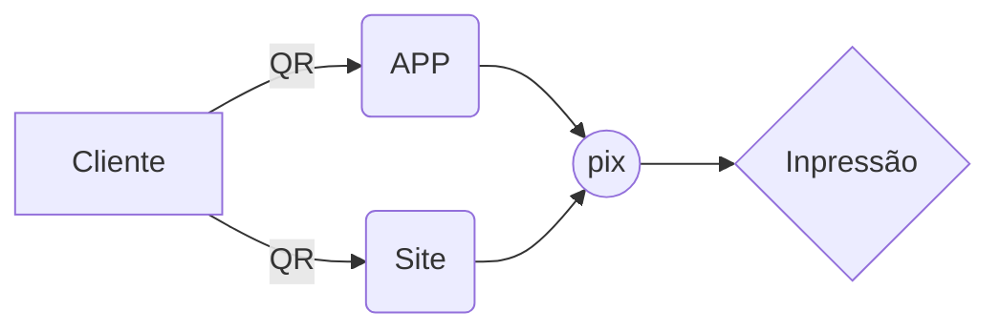

--- **Copia e Cia App!**
Em desenvolvimento...

## A idéia:

- Cliente ler o QR code, que o direciona para o site onde ele poderá fazer o download do app, ou realizar as ações pela webpage;
- Acessado App/Site cliente escolhe seus arquivos e configurações de impressão;
- Passo anterior concluído, realiza o pagamento;
- E Voilà! A impressão ocorre "automaticamente".
## Este é o esquema básico da ideia:

## Stack utilizada

 
**Front-end:** React, Bootstrap
**Back-end:** Node, Express, MySQL, Axios
